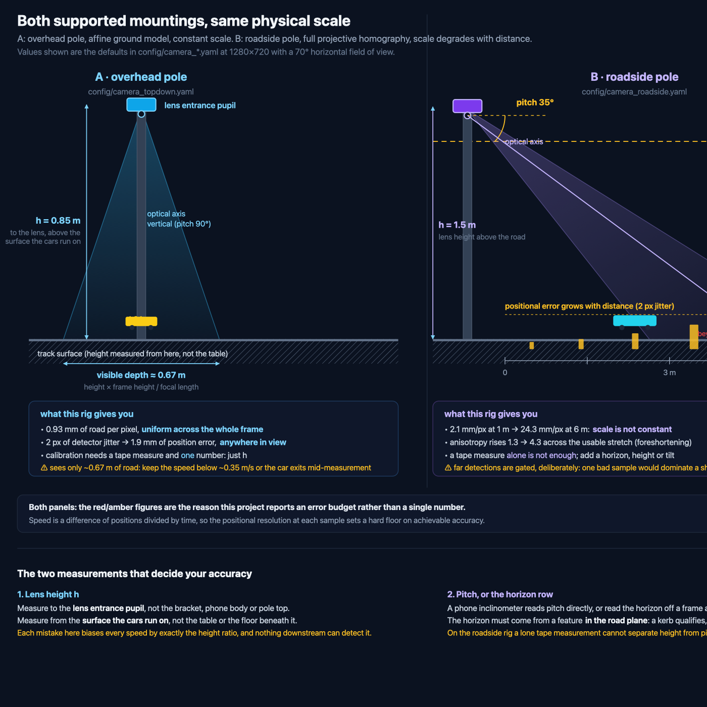

# yolo-cardetect

Detect 1:64-scale Hot Wheels cars passing along a "street" and estimate their real-world
speed, from a single camera mounted on a pole.

Built to run on a workstation, on an **Orange Pi 3B** (NPU, real time), and on a
**Raspberry Pi Zero 2 W** (512 MB RAM, a few FPS, motion-triggered burst capture).

---

## The two mounting configurations (both supported)

You asked for both, and they are genuinely different problems rather than two settings of
one knob.

| | **A — Overhead** (`kind: topdown`) | **B — Roadside** (`kind: roadside`) |
|---|---|---|
| Camera | On a pole **above** the track, pitched down | On a pole **beside** the track, pitched down |
| Geometry | Near-orthographic → **affine** map | Full **projective homography** |
| Scale | **Constant** across the frame | Varies strongly with distance |
| Speed error | Independent of where the car is | Degrades with distance, so far detections are gated |
| Calibration | One tape measurement, or just `height / focal_length` | Tape measurement **plus** a horizon or height prior |
| Recommended for | Table-top tracks — **most accurate** | Realistic street view, longer sight lines |

Both are selected by one config line. See `config/camera_topdown.yaml` and
`config/camera_roadside.yaml`.

```bash
# Configuration A
uv run cardetect run --config config/camera_topdown.yaml --source 0

# Configuration B
uv run cardetect run --config config/camera_roadside.yaml --source track.mp4
```

---

## Install

```bash
uv sync --extra vision        # workstation: detection + tracking
uv sync --extra calibration   # calibration only (no torch, no model download)
uv run cardetect doctor       # report what this device can actually do
```

`uv` is used throughout instead of `pip` (project convention). The dependency layering is
deliberate: `geometry` and `speed` need **NumPy only**, so they import and test on a Raspberry Pi
Zero 2 W, while OpenCV, torch and ultralytics are pulled in lazily by the layers that need them.
`uv run cardetect doctor` reports exactly which of those are present.

## Commands

```bash
# What is this device capable of?
uv run cardetect doctor

# Validate a config and print the resolved geometry. Needs no detector, no model, no camera.
uv run cardetect check --config config/camera_topdown.yaml

# Where on the road can this rig actually measure? Reports mm/pixel and the error budget.
uv run cardetect preview --config config/camera_roadside.yaml --save-geometry

# Calibrate: two marks and a tape measure. No printing required.
uv run cardetect calibrate topdown  --config config/camera_topdown.yaml --write-config
uv run cardetect calibrate roadside --config config/camera_roadside.yaml

# Run it.
uv run cardetect run --config config/camera_topdown.yaml --source 0        # webcam / Pi cam
uv run cardetect run --config config/camera_topdown.yaml --source clip.mp4 # file
```

`preview` and `check` are the two commands worth having on a device that cannot run the detector at
all: they answer "is my geometry right?" and "what will happen when I point this at the track?"
using NumPy and the configuration file alone. That is exactly the situation on a Pi Zero 2 W before
its model has been exported.

## Calibrate

The chosen workflow is **a tape measure and two marks on the "street"**.

A single measured distance cannot determine a 2D ground homography on its own — it yields a
similarity (rotation + scale), because height and pitch trade off against each other: a camera twice
as high aimed twice as steeply sees nearly the same image. So the two rigs differ:

* **Overhead** — one distance plus an assumed image rotation pins the affine map completely. You can
  also skip clicking entirely by just measuring `height_m`, which is the most accurate option.
* **Roadside** — the measured distance must be accompanied by **one** of a horizon row (best), a
  measured lens height, or a known tilt. The command asks for one and says why. It will not guess,
  because a wrong height biases every speed by exactly the height ratio and those numbers look
  entirely reasonable.

If a printed marker ever becomes acceptable, an ArUco / four-point path exists and needs no priors.

## What the rig diagrams show

[`docs/rig-diagrams.svg`](docs/rig-diagrams.svg) draws both mountings to a common physical scale and
labels the quantities the calibration needs. It is worth reading before mounting anything, because
it reports consequences rather than just shapes:

* overhead: 0.93 mm of road per pixel, **uniform across the whole frame**
* roadside: 2.1 mm/px at 1 m degrading to 24.3 mm/px at 6 m, with the error budget capping the
  usable range at 6.1 m



## Raspberry Pi notes (the honest version)

* **Pi Zero 2 W** — quad Cortex-A53 @ 1 GHz, 512 MB, **no NPU**. Expect roughly **1–4 FPS** at
  320–416 px with a nano model. It cannot process video continuously, so `--mode burst` watches for
  motion cheaply and captures a short high-FPS clip when a car appears, then analyses that clip.
  Nothing is lost, because speed is a per-track quantity — only the frames containing the car matter,
  and those are exactly the frames captured.
* **Orange Pi 3B** — has an NPU. Export to RKNN for real time; the full walkthrough for both
  boards, including export commands and a symptom-to-cause table, is in [docs/deployment.md](docs/deployment.md).
* The Pi Camera Module has **no hardware timestamps** and `CAP_PROP_FPS` is unreliable, so
  timestamps are taken from a monotonic clock sampled after each grab rather than assumed to be
  `frame_index / fps`. That single design decision is what keeps a Pi deployment's speeds accurate.
* `quantize: auto` enables 16-bit precision **only on CUDA**. On CPU it is slower *and* less
  accurate, so the obvious "lower precision is faster" rule would silently cost accuracy here.

## Why the geometry module is the careful part

Every speed is a *difference of positions* divided by time, so accuracy is decided by how
well pixels become metres. `src/cardetect/geometry.py` is therefore written and tested with
unusual care, and it deliberately depends on **NumPy only** so it can be tested headless and
deployed on a memory-constrained device.

Passing the three physical invariants in `tests/test_geometry.py` is what pins the sign
conventions. During development, four different sign combinations all produced perfectly
orthonormal rotation matrices *and* projections that matched `cv2.projectPoints` to 1e-12 px
— because OpenCV was simply handed the same wrong matrix. Only physical checks expose that:
the optical axis must meet the road at the image centre, nearer ground must appear lower, and
`+X` must appear right.

## Layout

```
config/                default.yaml plus one file per mounting configuration
src/cardetect/
  geometry.py          camera models, projections, calibration solvers   (NumPy only)
  speed.py             robust metric velocity estimation                 (NumPy only)
  config.py            layered configuration loading and validation      (NumPy only)
  source.py            capture with explicit timestamp regimes, burst mode
  detect.py            YOLO wrapper and ground-contact extraction
  track.py             association and per-track metric histories
  calibration.py       interactive two-mark tape calibration
  visualize.py         overlays, minimap and verification figures
  pipeline.py          run orchestration and artefact writing
  cli.py               the `cardetect` command
  tools/               synthetic ground-truth video generator
tests/                 geometry invariants, speed accuracy, calibration, synthetic end-to-end
docs/                  rig diagrams for both mountings, Pi/Orange Pi deployment guide
changelog/             one document per change, per AGENTS.md
```

## Status: what is verified and what is not

**Verified.** 105 tests pass. The geometry is validated against `cv2.projectPoints` and against
three physical invariants; the velocity estimator is validated against synthetic ground truth with
known speeds; and the full measurement chain runs end to end on generated footage, recovering the
speeds it was told to draw. Both mounting configurations are exercised, as is a two-vehicle scenario.

**Not yet verified.** The detector has never been run on real vehicles, and the live-camera path has
never been exercised against a physical camera. Both are implemented, and `cardetect run` reaches
them, but neither has produced a real measurement yet. The synthetic test footage uses flat coloured
rectangles, which a model trained on real cars correctly declines to detect — so the detector is
stubbed in those tests, deliberately, to isolate the code this project is responsible for.

The first real test is therefore: point a camera at a Hot Wheels track, run
`cardetect calibrate topdown`, then `cardetect run`. If the speeds look wrong, `preview` will say
whether the geometry is at fault before blaming the model.

## Conventions

This project follows the repository `AGENTS.md` where it applies. Two deliberate deviations,
recorded here rather than left implicit:

* §2 (`ESP32`/C++/`pioarduino`/`src/impl/main/globals.hpp`) does not apply to a standalone
  Python vision project. The *spirit* is kept: a modular importable package, rich structured
  comments, and code chosen for the best available approach rather than the first one.
* §3 `src/impl/ai/<implementation>` is a C++ include-path convention; the Python equivalent
  used here is one module per concern under `src/cardetect/`.

§1 (changelog per change) and §3 (plan reviewed before implementing, tests, visualisations)
are followed in full. `uv` is used for Python per §3.
